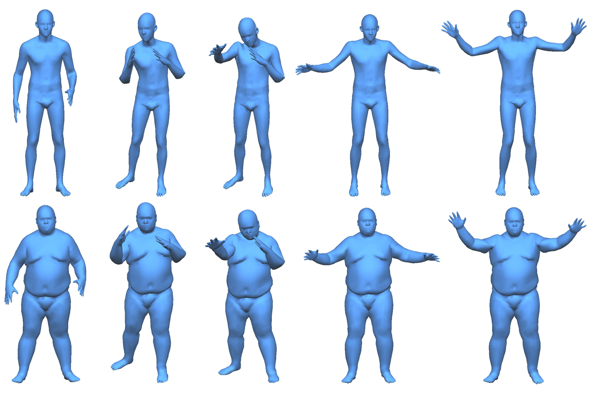
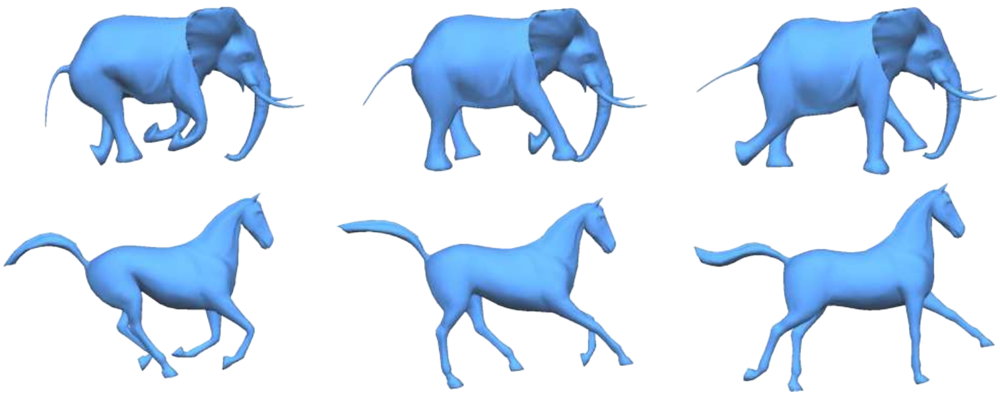

# [Automatic Unpaired Shape Deformation Transfer](http://geometrylearning.com/ausdt)
Lin Gao, Jie Yang, Yi-Ling Qiao, Yu-Kun Lai, Paul L. Rosin, Weiwei Xu and Shihong Xia

Code for "Automatic Unpaired Shape Deformation Transfer", Siggraph Asia 2018
<!--
<p align='center'>  
  
</p>
-->

## Goal

Propose an unsupervised (no need for the shape correspondence between the source shape and target shape) method to transfer the shape deformation between different 3D models.

## Abstract

Transferring deformation from a source shape to a target shape is a very useful technique in computer graphics. State-of-the-art deformation transfer methods require either point-wise correspondences between source and target shapes, or pairs of deformed source shapes with corresponding deformations.  

In this work, we propose a novel approach to automatic deformation transfer between two unpaired shape sets without any correspondences.

## Description

Given two sets of unpaired shapes, a source shape set S and a target shape set T, as well as a deformed source shape s, our aim is to produce a deformed target shape t which has visually similar deformation as s. Shapes in the same set S or T have the same connectivity. Many shape datasets satisfy this: they are either obtained by deforming a mesh model or fitting a template mesh model to deformed shapes. We do not assume shapes in S correspond to specific shapes in T, although we assume that S and T provide sufficient coverage of typical deformations of the relevant shapes. We learn a deep model with S and T as training examples. Once the deep model is trained, a shape t is generated for each input s.  

Experimental results show that our fully automatic method is able to obtain high-quality deformation transfer results with unpaired data sets, comparable or better than existing methods where strict correspondences are required.

## Prerequisites

The provided code has been tested and can be run on Linux. It is likely that the following instructions may test the code on Linux.
The dependence of operation system is listed.
+ **Ubuntu 16.04 or later**
+ **Python 3.6**
+ **NVIDIA GPU 8GB + CUDA 9.0 cuDNN 7.6.1**

## Preparetion

### Downloads
+ You need to download our code and data, please type the following commands.

		git clone https://github.com/gaolinorange/Ausdt_stamp.git

### Install

**Note: our code and the following commands need to be run in a virtual environment.**

+ Firstly, you need a virtual environment, please check if your python environment is already configured.

	**Note: pip >= 19.0 and virtualenv == 15.1.0**
	
		python3 --version
		pip3 --version
		virtualenv --version

	If these packages are already installed, skip to the next step.
	
		sudo apt update
		sudo apt install python3-dev python3-pip
		sudo pip3 install virtualenv==15.1.0
		
+ Secondly, if you complete the first step, you can install the virtual environment and the necessary library by typing the following commands.
	**Note: Especially, the package ```pymesh``` must be downloaded from [here](https://github.com/PyMesh/PyMesh/releases/download/v0.2.1/pymesh2-0.2.1-cp36-cp36m-linux_x86_64.whl), but we have included it in following script.**
	
		bash install.sh

+ Finally, after installing the necessary library, you need to ensure that the version of numpy is 1.16.0. 

		python -c "import numpy;print(numpy.__version__)"

	If not, you can correct it by typing the following commands.
	
		pip install numpy==1.16.0

## Access to Data and Checkpoint

All the test data and checkpoints have been uploaded to the Dropbox. So you must have a link with Dropbox to download them. We have preprocessed the raw data (mesh format) to format that can be fed into our network. The raw data have been turned into a ```*.mat``` file, you can download it from [here](https://drive.google.com/file/d/1uoxTuHANhnGRNd9aCULCE8W9WAz0sg4O/view?usp=sharing). You can place the file in the ```data``` dir of our repository. And for the checkpoint to reproduce the results, you can download it from [here](https://drive.google.com/file/d/1uoxTuHANhnGRNd9aCULCE8W9WAz0sg4O/view?usp=sharing). You can run the following command to get the data and checkpoint.
	
	bash download_data.sh

If you finish the above steps.The directory tree looks like this:


	Ausdt_stamp
	├── ckpt  # checkpoint dir
	│   ├── checkpoint
	│   │   ├── checkpoint
	│   │   ├── *.data-00000-of-00001
	│   │   ├── *.index
	│   │   └── *.meta
	│   └── *.ini
	├── code
	├── data
	│   └── *.mat # preprocess data
	├── imgs
	├── package
	│   └── pymesh*.whl
	├── download_data.sh
	├── install.sh
	└── README.md


## Usage
This section illustrates how to run the provided code and reproduce the representative result step by step. First, you must activate the virtual environment by the following command.

	source ~/venv_vcgan/bin/activate

+ If you need to run the code and train the whole network, please type the following commands.

		python code/train.py --A eleph --B horse --output_dir ./ckpt

+ If you only need to reproduce the representative result (figure 21 of the paper), please type the following commands.

		python code/test.py --output_dir ./ckpt

+ After running the code, you can obtain the results in the following directory. The generated shapefiles are all in ```*.obj``` format, which stores the vertice coordinate and face indices.

		cd ./ckpt/test_gan0/AtoB/B
	**Note: The directory ```ckpt/test_gan0/AtoB/A``` is the input shapes, and ```ckpt/test_gan0/AtoB/B``` is the transferred results by our methods.**

## Results
The section focuses on showing some our results of the experiment. The results are in figure 21 of the paper. The shapes in the first row are input shapes, and the shapes in the second row are transferred shapes.

<p align='center'>  
  
</p>

## Citation
If you found this code useful please cite our work as:

&nbsp;&nbsp;&nbsp;&nbsp;@article{gao2018vcgan,  
&nbsp;&nbsp;&nbsp;&nbsp;&nbsp;&nbsp;&nbsp;&nbsp;author = {Gao Lin, Yang Jie, Qiao Yi-Ling, Lai Yukun, Rosin, Paul, Xu Weiwei and Xia Shihong},  
&nbsp;&nbsp;&nbsp;&nbsp;&nbsp;&nbsp;&nbsp;&nbsp;title = {Automatic Unpaired Shape Deformation Transfer},  
&nbsp;&nbsp;&nbsp;&nbsp;&nbsp;&nbsp;&nbsp;&nbsp;journal = {ACM Transactions on Graphics},  
&nbsp;&nbsp;&nbsp;&nbsp;&nbsp;&nbsp;&nbsp;&nbsp;volume = {37},  
&nbsp;&nbsp;&nbsp;&nbsp;&nbsp;&nbsp;&nbsp;&nbsp;number = {6},  
&nbsp;&nbsp;&nbsp;&nbsp;&nbsp;&nbsp;&nbsp;&nbsp;pages = {1--15},  
&nbsp;&nbsp;&nbsp;&nbsp;&nbsp;&nbsp;&nbsp;&nbsp;year = {2018}  
&nbsp;&nbsp;&nbsp;&nbsp;}

